# SOC Mini-Lab: Snort + Wazuh + T-Pot + Shuffle SOAR


> **A fully integrated open-source SOC built in a virtualized lab environment.**  
> Detects and automatically responds to real attacks in under 15 seconds.  
> Stack: Kali Linux · Snort IDS/IPS · Wazuh SIEM · Windows 10 + Sysmon · T-Pot Honeypot · Shuffle SOAR

---

<p align="center">
  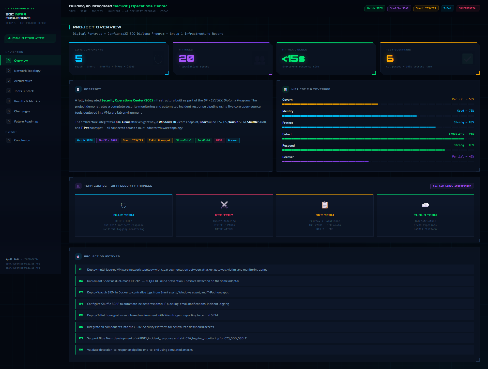
</p>

<h1 align="center">SOC Mini-Lab — Integrated Security Operations Center</h1>

<p align="center">
  <strong>A fully integrated, open-source SOC built in a virtualized lab environment.</strong><br>
  Network IDS/IPS &bull; SIEM Log Collection &bull; Honeypot Deception &bull; Automated Incident Response
</p>

<p align="center">
  
  
  
  
  
  
  
</p>

<p align="center">
  
  
  
  
</p>

---

## Table of Contents

- [Highlights](#-highlights)
- [Architecture Overview](#-architecture-overview)
- [Network Topology](#-network-topology)
- [Tools Used](#-tools--technology-stack)
- [Detection Pipeline](#-detection-pipeline)
- [Automation Workflow](#-automation-workflow)
- [Performance Results](#-performance-results)
- [Installation](#-installation-guide)
- [Screenshots](#-screenshots--demo)
- [Project Structure](#-project-structure)
- [Future Improvements](#-future-roadmap)
- [References](#-references)

---

## Highlights

<table>
<tr>
<td width="25%" align="center">
<h3>5</h3>
<strong>Core Components</strong><br>
<sub>Wazuh &bull; Snort &bull; Shuffle &bull; T-Pot &bull; Sysmon</sub>
</td>
<td width="25%" align="center">
<h3>&lt;15s</h3>
<strong>Attack to Block</strong><br>
<sub>End-to-end automated response</sub>
</td>
<td width="25%" align="center">
<h3>3</h3>
<strong>Active Agents</strong><br>
<sub>Kali + Windows + T-Pot</sub>
</td>
<td width="25%" align="center">
<h3>6/6</h3>
<strong>Tests Passed</strong><br>
<sub>100% detection rate</sub>
</td>
</tr>
</table>

> **End-to-end detection time:** 5-15 seconds from attack to automated response — no manual intervention required.

---

## Architecture Overview

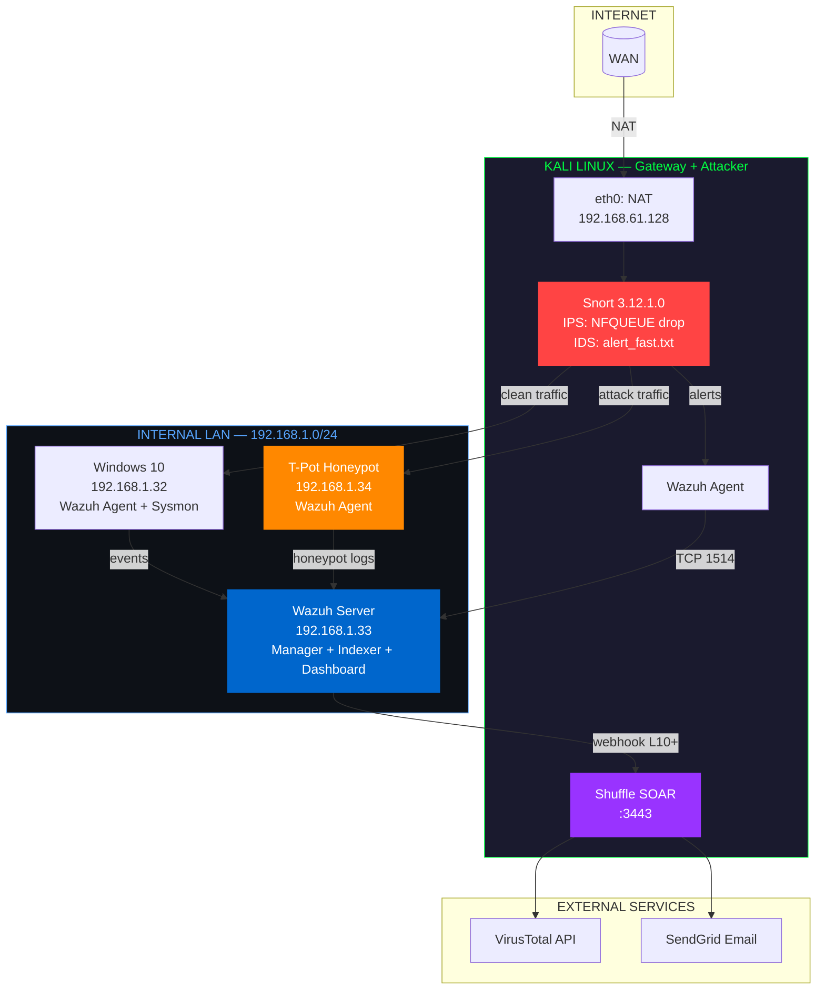

<details>
<summary><strong>View Architecture Dashboard Screenshot</strong></summary>
<br>
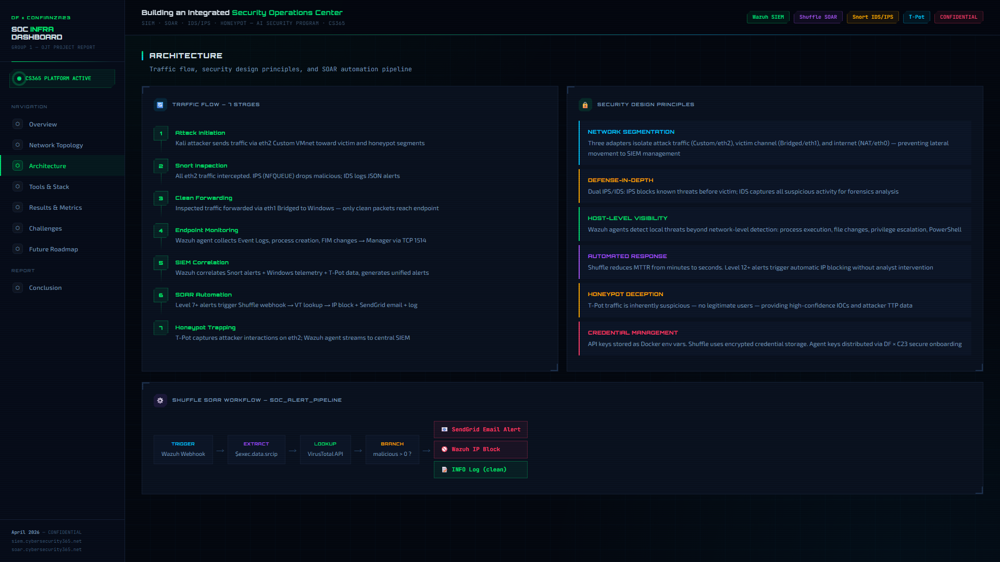
</details>

**Full architecture details:** [`architecture/README.md`](architecture/README.md)

---

## Network Topology

### IP Assignment

| Machine | Interface | IP Address | Network | Role |
|:--------|:----------|:-----------|:--------|:-----|
| Kali Linux | eth0 | `192.168.61.128` | NAT | Internet egress |
| Kali Linux | eth1 | `192.168.1.31` | Bridged | Internal LAN |
| Kali Linux | eth2 | `10.94.117.59` | Bridged | Snort inspection |
| Windows 10 | eth0 | `192.168.1.32` | Bridged | Victim + Wazuh agent |
| Wazuh Server | eth0 | `192.168.1.33` | Bridged | SIEM manager |
| T-Pot | eth0 | `192.168.1.34` | Bridged | Honeypot |
| Shuffle SOAR | Docker | `10.94.117.58:3443` | — | SOAR engine |

### Network Segments

| Segment | CIDR | Purpose |
|:--------|:-----|:--------|
| NAT | `192.168.61.0/24` | Internet access for Kali only |
| Internal LAN | `192.168.1.0/24` | All agents to Wazuh manager |
| Management | `10.94.117.0/24` | Snort interface + Shuffle |

### Traffic Flow

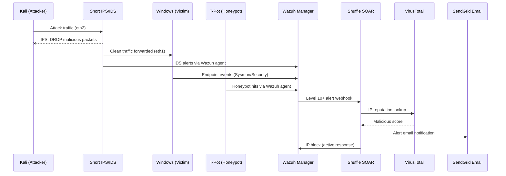

<details>
<summary><strong>View Network Topology Dashboard</strong></summary>
<br>
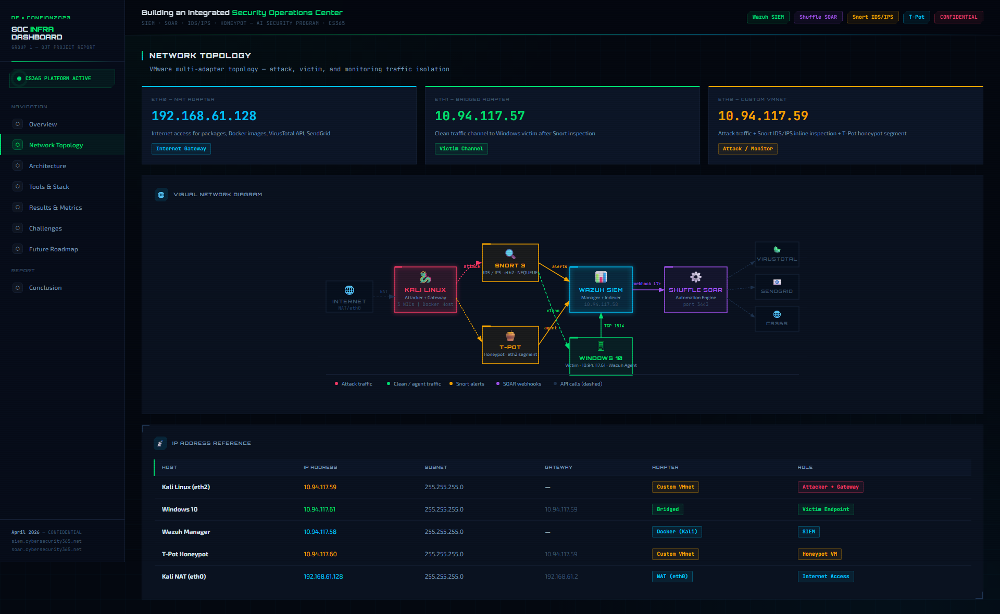
</details>

**Full topology details:** [`topology/README.md`](topology/README.md)

---

## Tools & Technology Stack

| Tool | Version | Purpose | License |
|:-----|:--------|:--------|:--------|
| Kali Linux | 2025.4 | Attacker + gateway + Docker host | GPL |
| Snort | 3.12.1.0 | Network IDS/IPS (NFQUEUE inline) | GPL-2.0 |
| Wazuh | 4.14.4 OVA | SIEM: Manager + Indexer + Dashboard | GPL-2.0 |
| Windows 10 | 10.0.17763 | Victim endpoint | Proprietary |
| Sysmon | v15 | Enhanced Windows event logging | Free |
| T-Pot | 24.04 HIVE | Multi-honeypot platform | Apache-2.0 |
| Shuffle SOAR | Latest | Automated incident response | GPL-3.0 |
| VirusTotal API | v3 | IP reputation lookups | Free tier |
| SendGrid | v3 API | Email notifications | Free tier |
| VMware Workstation | Pro | Kali + Windows virtualization | Proprietary |
| VirtualBox | Latest | Wazuh + T-Pot virtualization | GPL-2.0 |
| Docker | Latest | Shuffle containers | Apache-2.0 |
| iptables/NFQUEUE | Kernel | Inline packet routing to Snort | GPL |

### Feature Comparison

| Capability | Traditional SOC | This Lab |
|:-----------|:----------------|:---------|
| Detection method | Manual log review | Automated IDS/IPS + SIEM correlation |
| Response time | Minutes to hours | **< 15 seconds** |
| Threat intel | Manual IOC lookup | Automated VirusTotal enrichment |
| Alerting | Email on schedule | Real-time webhook + email |
| Honeypot integration | Separate system | Unified in SIEM pipeline |
| Incident response | Manual playbooks | SOAR-automated workflows |

<details>
<summary><strong>View Tools & Stack Dashboard</strong></summary>
<br>
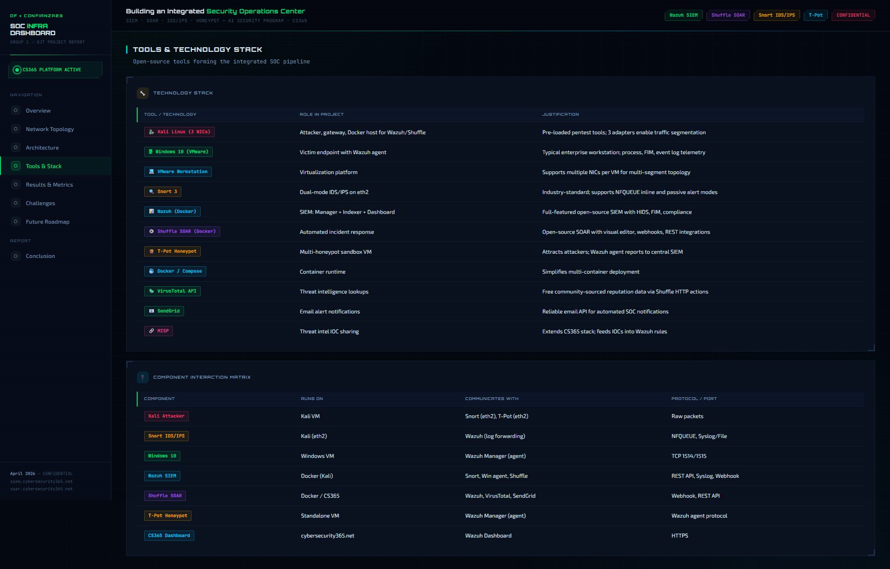
</details>

---

## Detection Pipeline

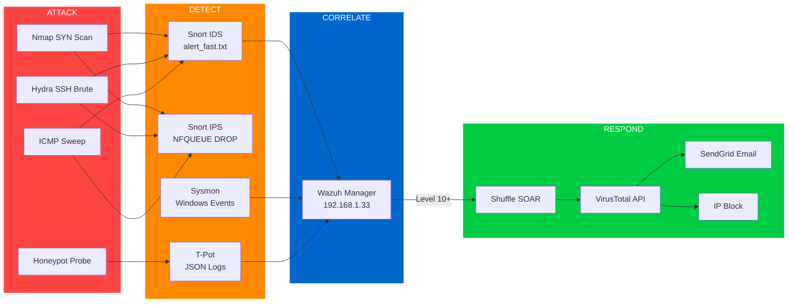

### Custom Snort Rules

| SID | Type | Rule | Threshold |
|:----|:-----|:-----|:----------|
| 1000001 | IDS | ICMP Ping Sweep | 5 pings / 2 sec |
| 1000002 | IDS | Nmap SYN Port Scan | 20 SYN / 1 sec |
| 1000003 | IDS | SSH Brute Force | 5 attempts / 60 sec |
| 1000004 | IDS | HTTP Non-Standard Port (C2) | per packet |
| 1000005 | **IPS** | **Aggressive Port Scan** | **30 SYN / 5 sec** |
| 1000006 | IDS | RDP Brute Force | 5 attempts / 30 sec |
| 1000007 | **IPS** | **ICMP Flood** | **50 pings / 1 sec** |
| 1000008 | IDS | FTP Login Attempt | per packet |
| 1000009 | IDS | DNS Amplification | dsize > 512 |

**Detection rules, decoders, and rule IDs:** [`detection-pipeline/README.md`](detection-pipeline/README.md)

---

## Automation Workflow

### Shuffle SOAR — Alert Enrichment Pipeline

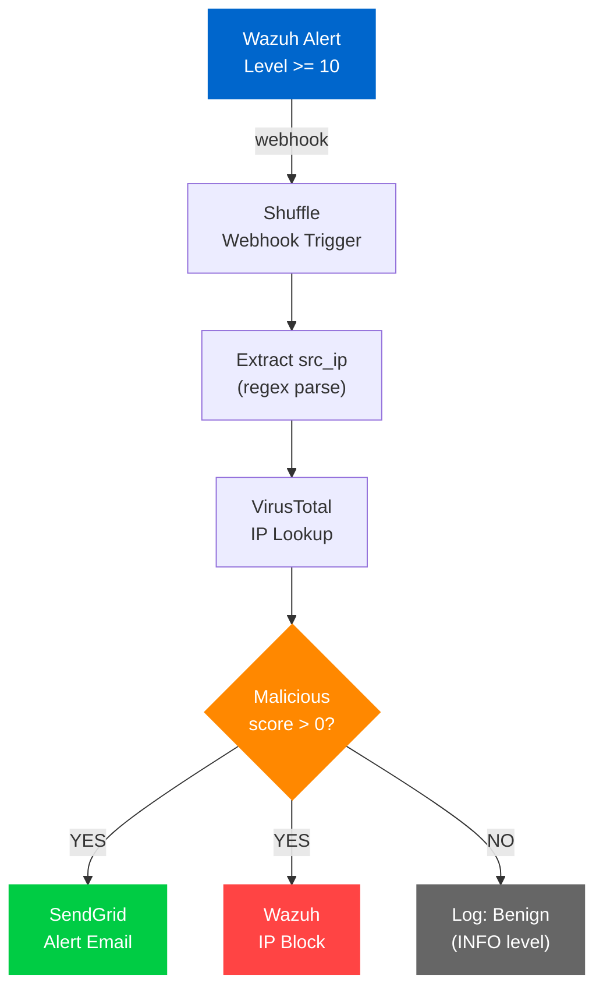

**Trigger condition:** Wazuh alert level >= 10
**Average response time:** < 15 seconds from detection to email

**Full workflow documentation:** [`automation-workflows/shuffle-lab1.md`](automation-workflows/shuffle-lab1.md)

---

## Performance Results

| Metric | Result | Rating |
|:-------|:-------|:-------|
| Snort to Wazuh latency | 1-3 seconds | Excellent |
| Wazuh to Shuffle latency | 2-5 seconds | Good |
| End-to-end (attack to block) | **5-15 seconds** | Excellent |
| VirusTotal API response | 1-3 seconds | Free Tier |
| T-Pot capture rate | 100% | Excellent |
| Email delivery (SendGrid) | 3-10 seconds | Good |
| Dashboard query time | 1-2 seconds | Good |

### Validated Attack Scenarios

| # | Attack | Tool | IPS Response | IDS Alert | SOAR Action | Status |
|:--|:-------|:-----|:-------------|:----------|:------------|:-------|
| 1 | Port scan | `nmap -sS` | Blocked after 30 SYN/5s | Rule 1000002 | Email sent | PASS |
| 2 | SSH brute force | `hydra` | Blocked after 5 attempts | Rule 1000003 | IP blocked | PASS |
| 3 | ICMP sweep | `ping -c` | Blocked after 50/s | Rule 1000001 | Logged | PASS |
| 4 | Malicious IP probe | `curl` | N/A | Wazuh alert | VT score > 0 - email | PASS |
| 5 | Honeypot SSH | `ssh` to T-Pot | N/A | Rule 200002 | Dashboard alert | PASS |
| 6 | FIM change | File edit on Win | N/A | Sysmon EID 1 | Dashboard alert | PASS |

<details>
<summary><strong>View Results & Performance Dashboard</strong></summary>
<br>
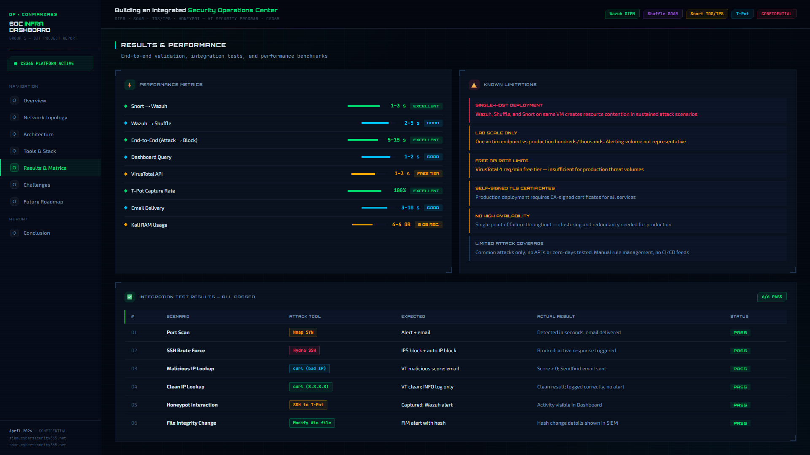
</details>

---

## Installation Guide

Follow these guides in order:

| Step | Guide | Time |
|:-----|:------|:-----|
| 0 | [External Accounts Setup](installation/00-accounts-setup.md) | 15 min |
| 1 | [Kali Environment Setup](installation/01-kali-setup.md) | 20 min |
| 2 | [Snort IDS/IPS Configuration](installation/02-snort-ids-ips.md) | 30 min |
| 3 | [Wazuh Agent on Kali](installation/03-wazuh-agent-kali.md) | 20 min |
| 4 | [Windows Agent + Sysmon](installation/04-windows-agent-sysmon.md) | 25 min |
| 5 | [T-Pot Honeypot](installation/05-tpot-honeypot.md) | 60 min |
| 6 | [Shuffle SOAR Workflow](installation/06-shuffle-soar.md) | 30 min |
| 7 | [End-to-End Verification](installation/07-verification.md) | 15 min |

### Prerequisites

- VMware Workstation Pro (any recent version)
- VirtualBox (latest)
- Kali Linux VM with 3 network adapters configured
- Minimum **16 GB RAM** on host machine (8 GB for T-Pot alone)

---

## Screenshots & Demo

<!-- GIF placeholder: Replace with your own demo recording -->
<!--
<p align="center">
  
  <br>
  <em>Full attack-to-response pipeline in action</em>
</p>
-->

### SOC Dashboard Overview


### Network Topology


### Architecture & Traffic Flow


### Tools & Technology Stack


### Results & Performance Metrics


### Challenges & Solutions
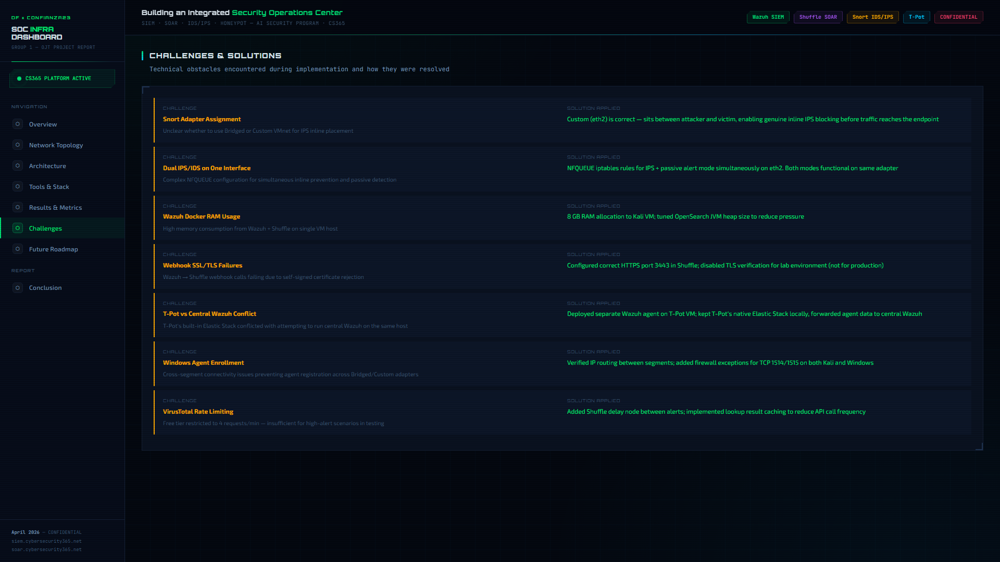

### Future Roadmap
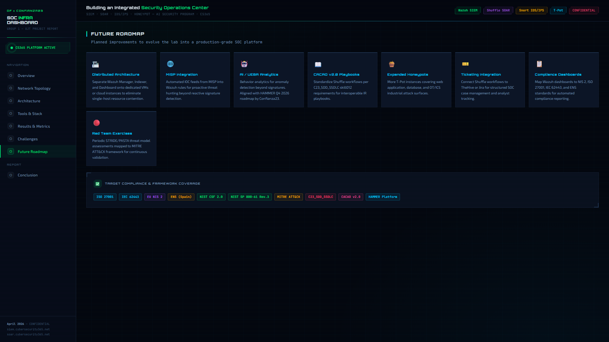

> **Need more screenshots?** See [`screenshots/README.md`](screenshots/README.md) for the full capture guide (15 required shots).

---

## Project Structure

```
SOC-Lab/
|
|-- README.md                          # You are here
|-- architecture/
|   +-- README.md                      # Component interaction + data flow
|-- topology/
|   +-- README.md                      # Network design + traffic flow
|-- installation/
|   |-- 00-accounts-setup.md           # VirusTotal + SendGrid accounts
|   |-- 01-kali-setup.md              # Kali network configuration
|   |-- 02-snort-ids-ips.md           # Snort full setup guide
|   |-- 03-wazuh-agent-kali.md        # Wazuh agent on Kali
|   |-- 04-windows-agent-sysmon.md    # Windows agent + Sysmon
|   |-- 05-tpot-honeypot.md           # T-Pot install guide
|   |-- 06-shuffle-soar.md            # Shuffle workflow build
|   +-- 07-verification.md            # End-to-end test checklist
|-- configurations/
|   |-- snort.lua                      # Snort 3 main config
|   |-- local.rules                    # Custom IDS/IPS detection rules
|   |-- ossec-kali-agent.conf         # Wazuh agent config (Kali)
|   |-- ossec-windows-snippet.xml     # Windows agent localfile blocks
|   |-- tpot-decoder.xml              # Custom T-Pot Wazuh decoder
|   +-- tpot-rules.xml                # Custom T-Pot Wazuh rules
|-- detection-pipeline/
|   +-- README.md                      # Alert pipeline + rule reference
|-- automation-workflows/
|   +-- shuffle-lab1.md                # SOAR workflow documentation
|-- screenshots/
|   +-- README.md                      # Screenshot guide + placeholders
|-- scripts/
|   |-- setup-nfqueue.sh              # iptables NFQUEUE setup
|   +-- verify-lab.sh                  # Full lab health check
|-- troubleshooting/
|   +-- README.md                      # Common errors + fixes
+-- references/
    +-- README.md                      # All links + citations
```

---

## Future Roadmap

- [ ] **Distributed architecture** — separate Wazuh components onto dedicated VMs/cloud
- [ ] **MISP integration** — automated IOC feeds for proactive threat hunting
- [ ] **AI/UEBA** — behavior analytics for anomaly detection beyond signatures
- [ ] **CACAO v2.0 playbooks** — standardize Shuffle workflows
- [ ] **Expanded honeypots** — additional T-Pot instances (web, DB, OT/ICS)
- [ ] **Ticketing integration** — connect Shuffle to TheHive or Jira
- [ ] **Compliance dashboards** — map Wazuh to NIS 2, ISO 27001, IEC 62443
- [ ] **MITRE ATT&CK mapping** — tag detection rules with ATT&CK technique IDs
- [ ] **HA/clustering** — eliminate single point of failure
- [ ] **Automated rule feeds** — CI/CD for Snort + Wazuh rule deployment

<details>
<summary><strong>View Future Roadmap Dashboard</strong></summary>
<br>

</details>

---

## References

| Resource | URL |
|:---------|:----|
| Wazuh Documentation | https://documentation.wazuh.com |
| Snort 3 Documentation | https://docs.snort.org |
| Shuffle SOAR | https://shuffler.io/docs |
| T-Pot GitHub | https://github.com/telekom-security/tpotce |
| VirusTotal API v3 | https://developers.virustotal.com/reference |
| NIST CSF 2.0 | https://www.nist.gov/cyberframework |
| MITRE ATT&CK | https://attack.mitre.org |
| NIST SP 800-61 Rev. 3 | https://csrc.nist.gov/publications/detail/sp/800-61/rev-3/final |

Full references: [`references/README.md`](references/README.md)

---

<p align="center">
  <em>Built as a SOC prototype. Open-source tools, production-representative architecture.</em><br>
  <strong>Security Framework:</strong> <a href="https://www.nist.gov/cyberframework">NIST Cybersecurity Framework 2.0</a> — Detect, Respond, Recover
</p>
